# Lab4Web

Nama  : Sayyid Sulthan Abyan

NIM   : 312410496

Kelas : TI.24.A.5

---

# Praktikum 4: CSS Layout

## Langkah-Langkah Praktikum

### Membuat File Awal
Buat file baru bernama **`lab4_box.html`** sebagai dasar layout. Tambahkan tiga buah `
` untuk memahami konsep box. Tambahkan deklarasi CSS dengan properti `float` agar elemen sejajar horizontal.

**📸 Tampilan Code:**

**📸 Hasil Browser:**
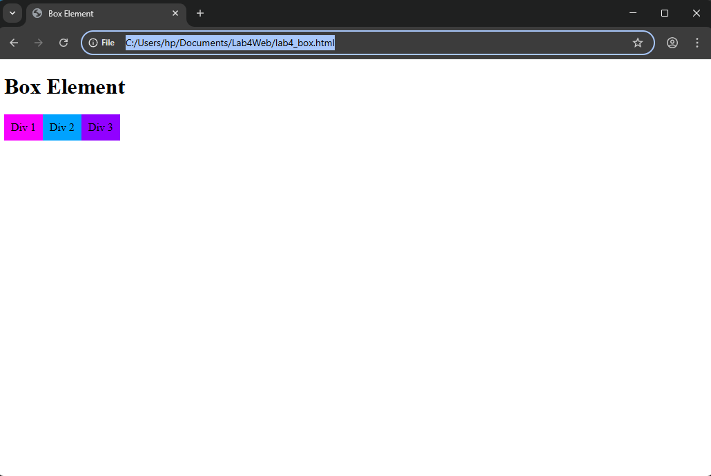

---

### Mengatur Clearfix Element
Tambahkan elemen tambahan untuk menguji properti `clear`.  
Coba nilai **left**, **right**, dan **both** untuk melihat perbedaannya.

**📸 Tampilan Code:**
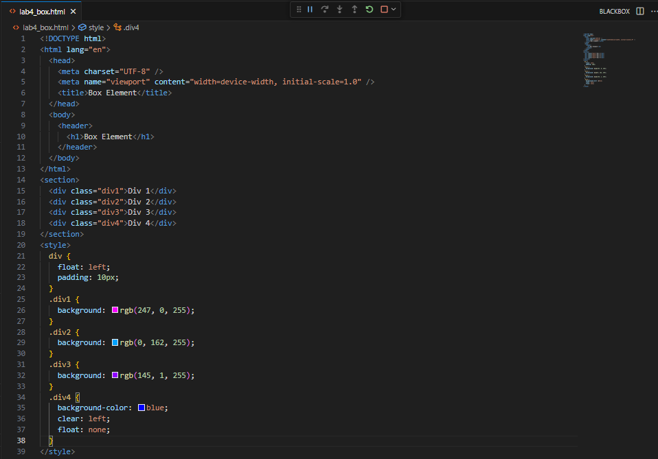

**📸 Hasil Browser:**
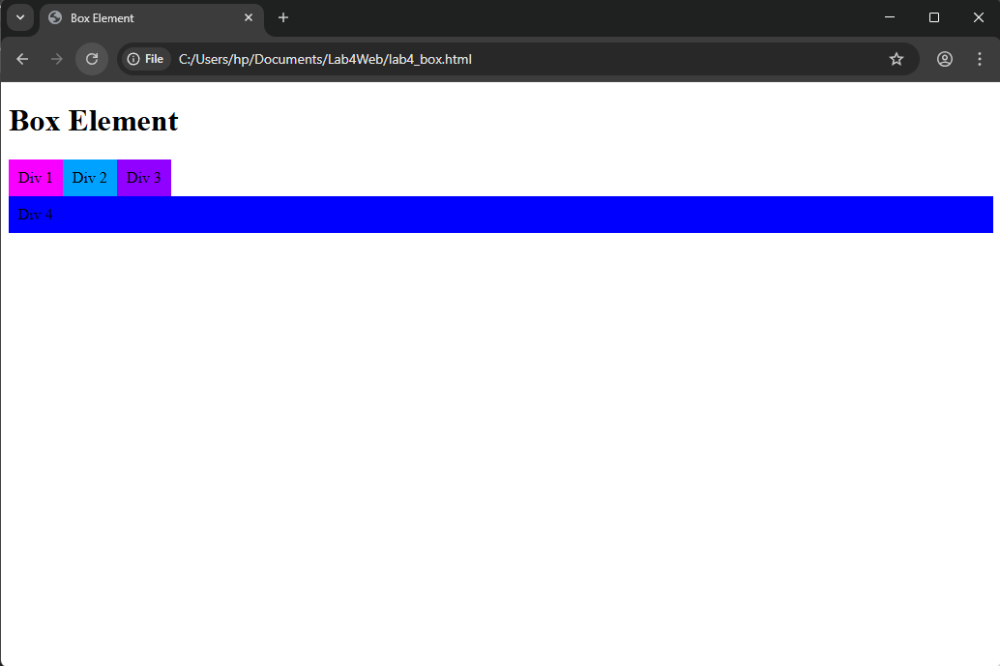

---

### Membuat Layout Web Sederhana
Buat folder baru bernama **`lab4_layout`** dan file **`home.html`** serta **`style.css`**. Tambahkan elemen `<header>` berisi judul halaman. 

**📸 Tampilan Code:**
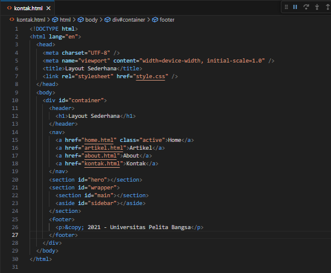

**📸 Hasil Browser:**
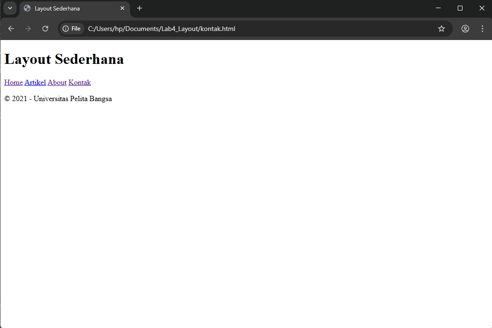

---

### Menambahkan Style css
Kemudian tambahkan kode CSS untuk membuat layoutnya.

**📸 Tampilan Code:**
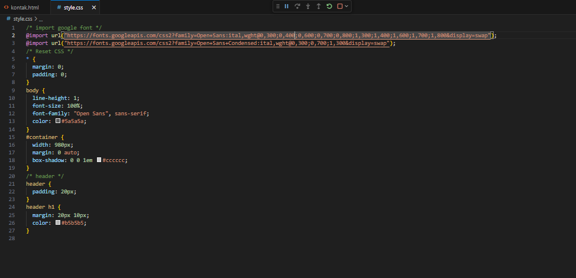

**📸 Hasil Browser:**
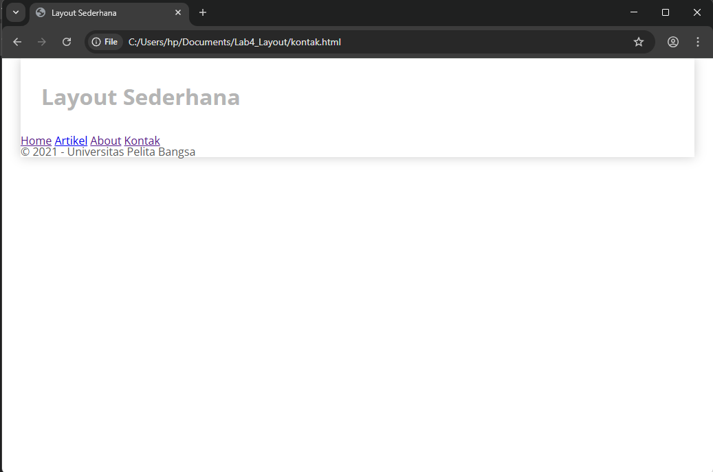

---

### Membuat Navigasi
Tambahkan elemen `<nav>` untuk menu utama dan atur tampilannya menggunakan CSS.

**📸 Tampilan Code:**
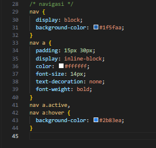

**📸 Hasil Browser:**
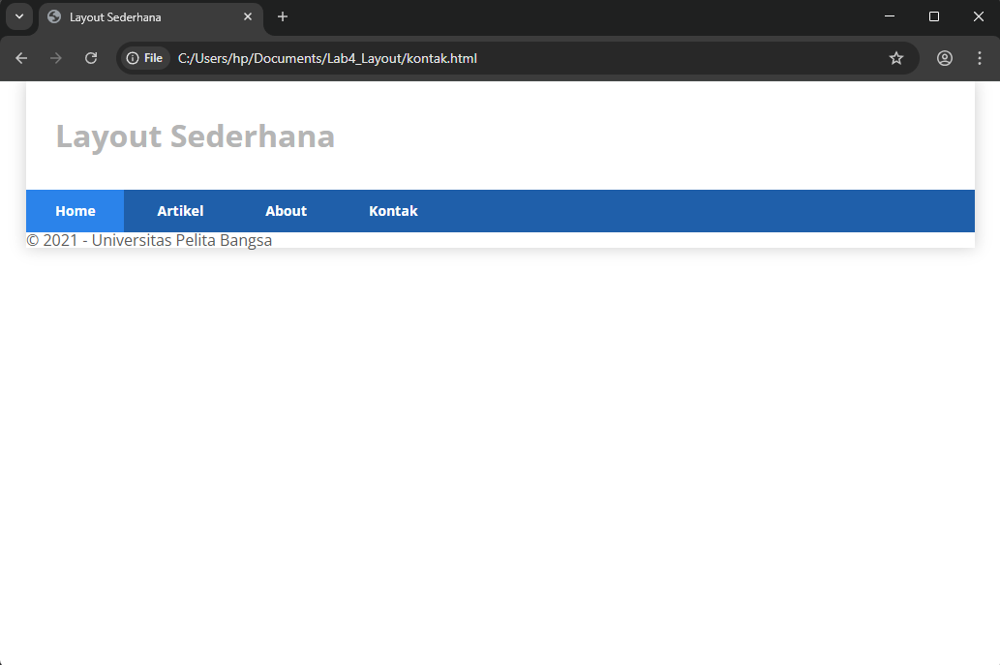

---

### Membuat Hero Panel
Tambahkan section **hero** berisi teks sambutan dan tombol aksi.

**📸 Tampilan Code:**
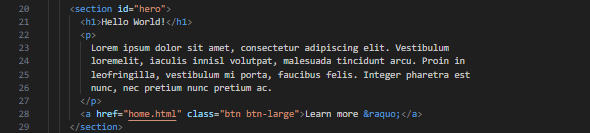

**📸 Hasil Browser:**
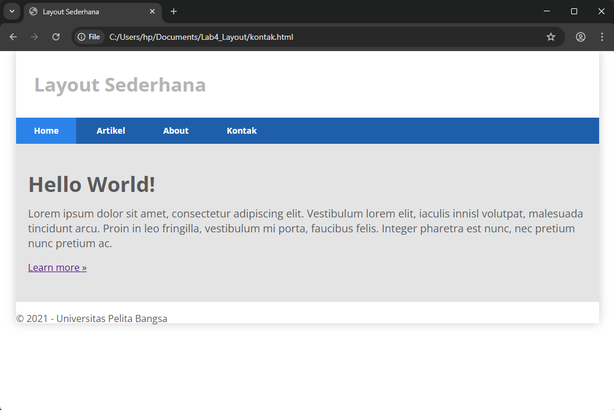

---

### Mengatur Layout Main dan Sidebar
Gunakan CSS `float` untuk memisahkan konten utama dan sidebar. Tambahkan elemen **widget** pada sidebar, seperti tautan atau teks tambahan.

**📸 Tampilan Code:**
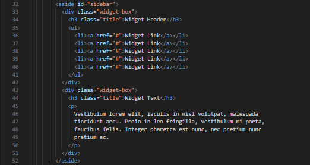

**📸 Hasil Browser:**
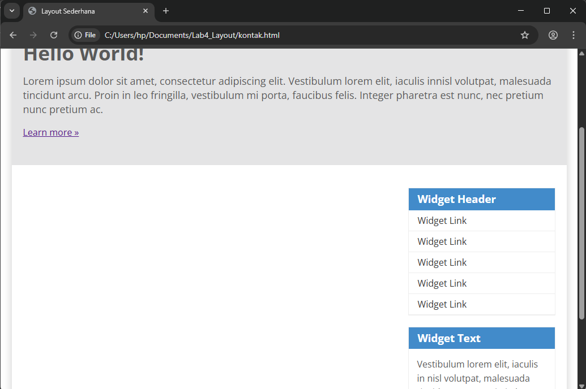

---

### Mengatur Footer
Tambahkan bagian **footer** di bawah halaman untuk informasi hak cipta.

**📸 Tampilan Code:**

**📸 Hasil Browser:**
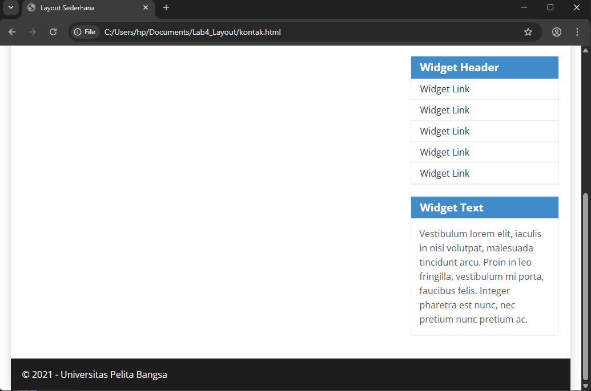

---

### Menambahkan Elemen pada Main Content
Tambahkan beberapa box bergambar dalam main content untuk mempercantik tampilan.

**📸 Tampilan Code:**
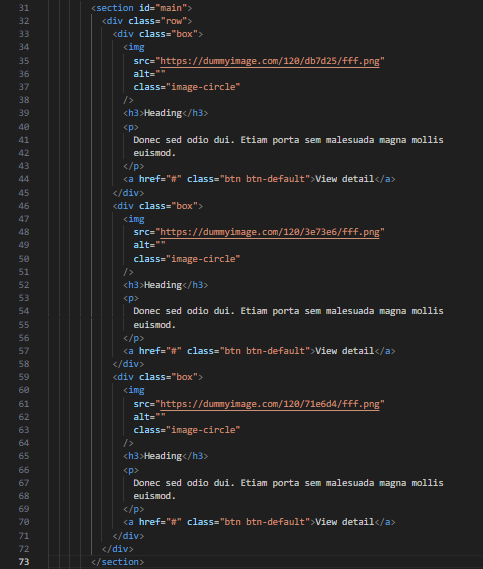
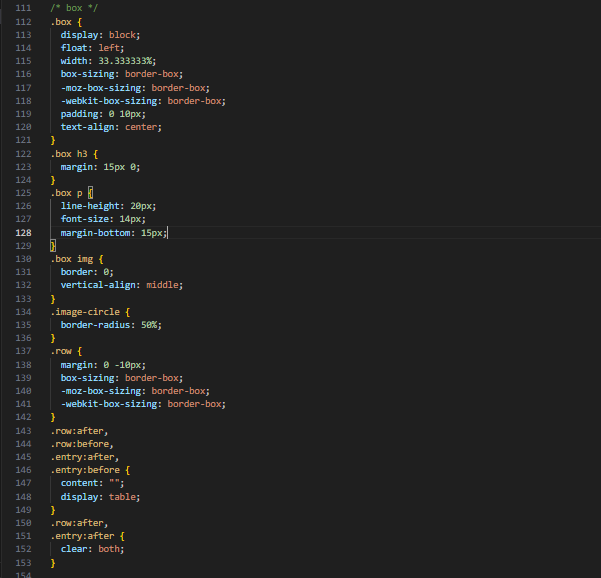

**📸 Hasil Browser:**
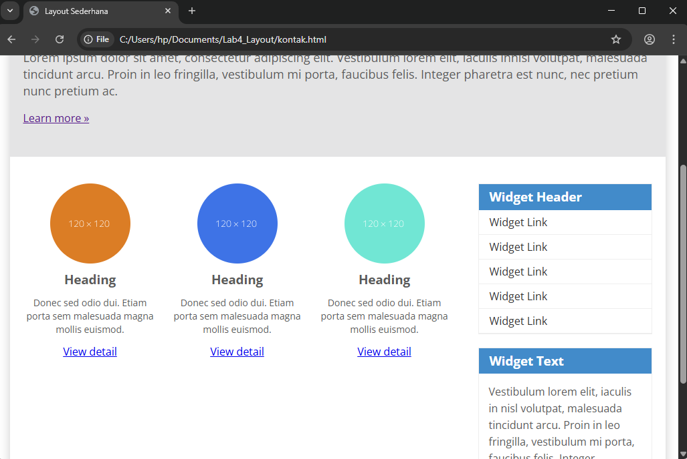

---

### Menambahkan Artikel
Tambahkan artikel dengan gambar dan teks menggunakan tag `<article>`.

**📸 Tampilan Code:**
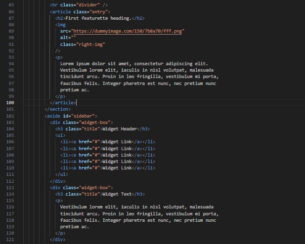
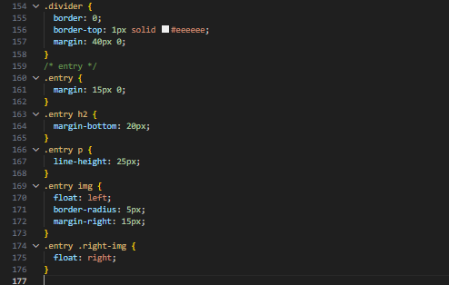

**📸 Hasil Browser:**

---

## Pertanyaan dan Tugas
1. Tambahkan **layout untuk menu About**, berisi deskripsi atau portfolio.

**📸 Hasil Browser:**
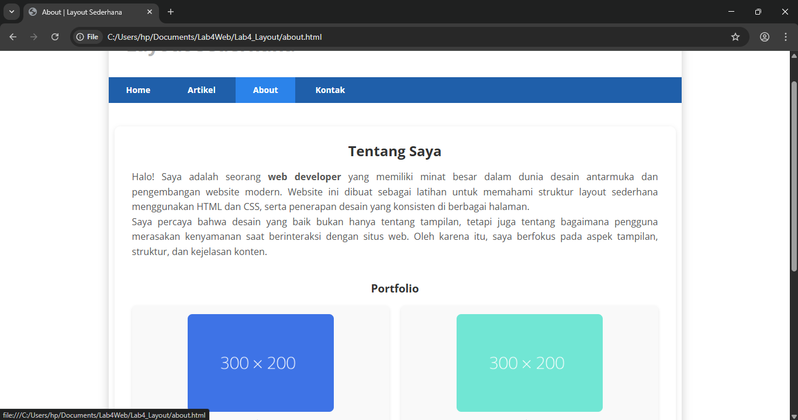

2. Tambahkan **layout untuk menu Contact**, berisi form isian:  
   - Nama  
   - Email  
   - Pesan  

**📸 Hasil Browser:**
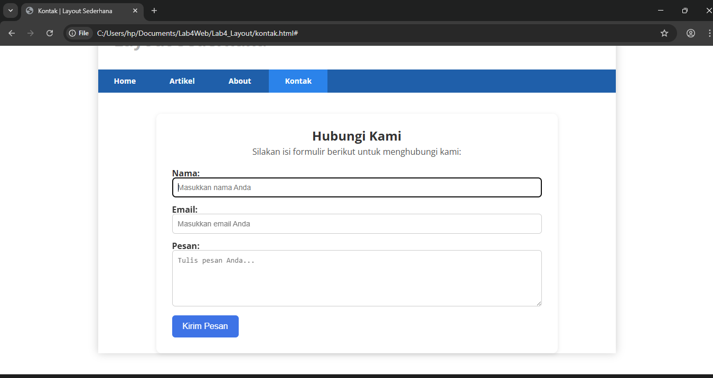

---

